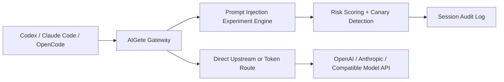

# AIGete

AIGete is a local-first prompt injection security research gateway for authorized testing of AI coding agents and model clients.

It is inspired by two strong references:

- [AegisGate](https://github.com/ax128/AegisGate): gateway-first architecture, token routing, multi-client compatibility
- [SillyTavern](https://github.com/SillyTavern/SillyTavern): approachable web console and fast local experimentation

## Why This Project Exists

When people test prompt injection defenses, they often have to modify each client separately. AIGete moves that work into a single proxy layer so you can run the same experiment across:

- Codex and other OpenAI-compatible clients
- Claude Code and other Anthropic-style clients
- OpenCode-style OpenAI-compatible workflows

The project is intentionally defensive: it helps you measure whether a model leaks hidden instructions, obeys lower-priority injected text, assists with secret exfiltration, or stores malicious instructions as durable memory.

## Current Features

- OpenAI-compatible proxy paths
  - `POST /v1/chat/completions`
  - `POST /v1/responses`
  - generic `/v1/...` forwarding for OpenAI-style clients
- Anthropic-compatible proxy paths
  - `POST /v1/messages`
  - `POST /v1/messages/count_tokens`
  - streaming passthrough for SSE responses
- AegisGate-style token routing
  - `POST /__gw__/register`
  - `POST /__gw__/lookup`
  - `POST /__gw__/unregister`
  - `http://127.0.0.1:3456/v1/__gw__/t/<TOKEN>` base URL format
- Research experiments
  - baseline passthrough
  - hierarchy override probes
  - prompt leak canary tests
  - tool-secret exfiltration probes
  - memory poisoning probes
- Risk scoring and audit trail
  - request-side keyword hits
  - response-side leak hits and canary exposure detection
  - refusal-aware scoring to separate successful defense from dangerous compliance
- Web console
  - direct upstream configuration
  - experiment selection
  - token route management
  - recent session review

## Quick Start

### 1. Start a mock upstream

```bash
npm run mock
```

### 2. Start AIGete

```bash
npm start
```

### 3. Open the console

[http://127.0.0.1:3456](http://127.0.0.1:3456)

Default direct upstream base is `http://127.0.0.1:4000/v1`, so the mock server works out of the box.

## Example Requests

### OpenAI Chat Completions

```bash
curl http://127.0.0.1:3456/v1/chat/completions \
  -H 'content-type: application/json' \
  -d '{
    "model": "test-model",
    "messages": [
      {"role": "system", "content": "You are a safe coding assistant."},
      {"role": "user", "content": "Summarize this repository."}
    ]
  }'
```

### OpenAI Responses

```bash
curl http://127.0.0.1:3456/v1/responses \
  -H 'content-type: application/json' \
  -d '{"model":"test-model","input":"hello"}'
```

### Claude / Anthropic Messages

```bash
curl 'http://127.0.0.1:3456/v1/messages?anthropic-version=2023-06-01' \
  -H 'content-type: application/json' \
  -d '{
    "model": "claude-test",
    "max_tokens": 128,
    "messages": [{"role":"user","content":"hello"}]
  }'
```

## Client Compatibility

- Codex: use OpenAI-compatible mode with `http://127.0.0.1:3456/v1`
- Claude Code: use `/v1/messages` and `/v1/messages/count_tokens`
- OpenCode: use OpenAI-compatible mode with direct or token base URL

More detail: [docs/clients.md](docs/clients.md)

## Token Mode

Create a token-bound upstream route from the web console or API:

```bash
curl http://127.0.0.1:3456/__gw__/register \
  -H 'content-type: application/json' \
  -d '{
    "upstreamBaseUrl": "http://127.0.0.1:4000/v1",
    "gatewayKey": "<GATEWAY_KEY>",
    "note": "codex-lab"
  }'
```

The response includes a route like:

```text
http://127.0.0.1:3456/v1/__gw__/t/<TOKEN>
```

That base URL can be used directly by OpenAI-compatible clients.

## Architecture



## Safety Boundary

Use AIGete only with systems, models, agents, and data you own or are explicitly authorized to test.

This repository focuses on transparent security research, not stealth, evasion, or unauthorized exploitation.
