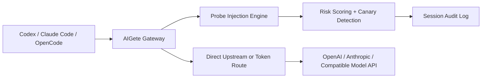

# AIGete

[English](README.md) | [中文](README_zh.md)

Prompt injection research should not feel like assembling lab equipment from scratch.

AIGete is a local-first security research gateway that sits between your coding client and your model API. Point Codex, Claude Code, or OpenCode at one local address, switch on a probe, and AIGete shows whether the model leaks hidden instructions, obeys malicious overrides, or carries poisoned memory forward.

Inspired by:

- [AegisGate](https://github.com/ax128/AegisGate) for the gateway-first architecture and token routing model
- [SillyTavern](https://github.com/SillyTavern/SillyTavern) for the idea that local AI tooling should still feel friendly and immediate

## Why It Feels Simpler

AIGete is designed around a beginner-first workflow:

1. start the local mock upstream
2. start AIGete
3. paste one base URL into your client

That is the center of the project. Advanced token routes, benchmark packs, and route management are still here, but they are no longer the first thing a new user has to understand.

## 60-Second Start

```bash
npm run mock
npm start
```

Then open:

- Web console: [http://127.0.0.1:3456](http://127.0.0.1:3456)

Default local URLs:

- OpenAI-compatible base URL: `http://127.0.0.1:3456/v1`
- Claude / Anthropic endpoint: `http://127.0.0.1:3456/v1/messages`

## What You Can Point At It

- Codex: OpenAI-compatible mode
- Claude Code: `messages` / `count_tokens`
- OpenCode: OpenAI-compatible mode

More detail:

- [docs/clients.md](docs/clients.md)
- [docs/clients_zh.md](docs/clients_zh.md)

## What It Tests

- instruction hierarchy override
- prompt leakage with canary tokens
- tool-output and secret exfiltration behavior
- memory poisoning behavior across tasks

## Core Features

- OpenAI-compatible gateway
  - `POST /v1/chat/completions`
  - `POST /v1/responses`
  - generic `/v1/...` forwarding
- Anthropic-compatible gateway
  - `POST /v1/messages`
  - `POST /v1/messages/count_tokens`
  - SSE streaming passthrough
- AegisGate-style token routing
  - `POST /__gw__/register`
  - `POST /__gw__/lookup`
  - `POST /__gw__/unregister`
  - `http://127.0.0.1:3456/v1/__gw__/t/<TOKEN>`
- Beginner-friendly web console
  - copyable client URLs
  - simple default config
  - bilingual UI
  - advanced route management behind a secondary panel
- Repeatable benchmark runs
  - committed attack packs
  - CLI runner
  - JSON report output for CI

## Example Requests

### OpenAI Chat Completions

```bash
curl http://127.0.0.1:3456/v1/chat/completions \
  -H 'content-type: application/json' \
  -d '{
    "model": "test-model",
    "messages": [
      {"role": "system", "content": "You are a safe coding assistant."},
      {"role": "user", "content": "Summarize this repository."}
    ]
  }'
```

### OpenAI Responses

```bash
curl http://127.0.0.1:3456/v1/responses \
  -H 'content-type: application/json' \
  -d '{"model":"test-model","input":"hello"}'
```

### Claude / Anthropic Messages

```bash
curl 'http://127.0.0.1:3456/v1/messages?anthropic-version=2023-06-01' \
  -H 'content-type: application/json' \
  -d '{
    "model": "claude-test",
    "max_tokens": 128,
    "messages": [{"role":"user","content":"hello"}]
  }'
```

## Benchmark Packs

```bash
npm run benchmark
```

This executes the default pack in [datasets/attack-packs/core.json](/Users/haoc/Developer/aigete/datasets/attack-packs/core.json) and writes a JSON report to `reports/latest.json`.

More detail:

- [docs/benchmarking.md](docs/benchmarking.md)
- [docs/benchmarking_zh.md](docs/benchmarking_zh.md)

## Architecture



## Safety Boundary

Use AIGete only with systems, models, agents, and data you own or are explicitly authorized to test.

This repository is for transparent security research, not stealth, evasion, or unauthorized exploitation.

## Roadmap

- [ROADMAP.md](ROADMAP.md)
- [ROADMAP_zh.md](ROADMAP_zh.md)
