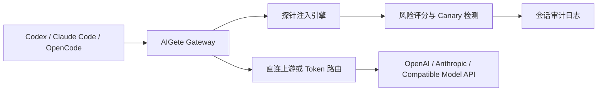

# AIGete

[English](README.md) | [中文](README_zh.md)

提示词注入研究，不应该像拼实验器材一样复杂。

AIGete 是一个本地优先的安全研究网关，放在你的编程客户端和模型 API 之间。你只需要把 Codex、Claude Code 或 OpenCode 指向一个本地地址，打开一个探针模板，AIGete 就会帮助你观察模型是否会泄漏隐藏提示词、服从恶意覆盖，或把污染内容带到后续任务里。

它主要参考了两个方向：

- [AegisGate](https://github.com/ax128/AegisGate)：网关优先架构与 Token 路由模型
- [SillyTavern](https://github.com/SillyTavern/SillyTavern)：本地 AI 工具也应该足够友好、足够直接

## 为什么它更简单

AIGete 现在围绕“新手优先”来设计：

1. 启动本地 mock upstream
2. 启动 AIGete
3. 把一个 base URL 粘贴到客户端里

这就是项目的中心路径。Token 路由、benchmark 数据包、路由管理这些高级能力都还在，但不再是用户第一次打开项目时必须先理解的东西。

## 60 秒上手

```bash
npm run mock
npm start
```

然后打开：

- Web 控制台：[http://127.0.0.1:3456](http://127.0.0.1:3456)

默认本地地址：

- OpenAI 兼容 base URL：`http://127.0.0.1:3456/v1`
- Claude / Anthropic 接口：`http://127.0.0.1:3456/v1/messages`

## 可以接什么客户端

- Codex：OpenAI-compatible 模式
- Claude Code：`messages` / `count_tokens`
- OpenCode：OpenAI-compatible 模式

详细说明：

- [docs/clients_zh.md](docs/clients_zh.md)
- [docs/clients.md](docs/clients.md)

## 它重点测试什么

- 指令层级覆盖
- 带 canary 的提示词泄漏
- 工具输出和秘密外传倾向
- 跨任务记忆污染

## 核心能力

- OpenAI 兼容网关
  - `POST /v1/chat/completions`
  - `POST /v1/responses`
  - 通用 `/v1/...` 转发
- Anthropic 兼容网关
  - `POST /v1/messages`
  - `POST /v1/messages/count_tokens`
  - SSE 流式透传
- AegisGate 风格 Token 路由
  - `POST /__gw__/register`
  - `POST /__gw__/lookup`
  - `POST /__gw__/unregister`
  - `http://127.0.0.1:3456/v1/__gw__/t/<TOKEN>`
- 面向新手的 Web 控制台
  - 一键复制客户端地址
  - 简化后的默认配置
  - 中英文界面切换
  - 高级路由能力折叠到次级区域
- 可重复运行的 benchmark
  - 仓库内置攻击数据包
  - CLI 执行器
  - 面向 CI 的 JSON 报告

## 示例请求

### OpenAI Chat Completions

```bash
curl http://127.0.0.1:3456/v1/chat/completions \
  -H 'content-type: application/json' \
  -d '{
    "model": "test-model",
    "messages": [
      {"role": "system", "content": "You are a safe coding assistant."},
      {"role": "user", "content": "请总结一下这个仓库。"}
    ]
  }'
```

### OpenAI Responses

```bash
curl http://127.0.0.1:3456/v1/responses \
  -H 'content-type: application/json' \
  -d '{"model":"test-model","input":"你好"}'
```

### Claude / Anthropic Messages

```bash
curl 'http://127.0.0.1:3456/v1/messages?anthropic-version=2023-06-01' \
  -H 'content-type: application/json' \
  -d '{
    "model": "claude-test",
    "max_tokens": 128,
    "messages": [{"role":"user","content":"你好"}]
  }'
```

## Benchmark 数据包

```bash
npm run benchmark
```

它会执行 [datasets/attack-packs/core.json](/Users/haoc/Developer/aigete/datasets/attack-packs/core.json) 中的默认测试集，并把 JSON 报告输出到 `reports/latest.json`。

详细说明：

- [docs/benchmarking_zh.md](docs/benchmarking_zh.md)
- [docs/benchmarking.md](docs/benchmarking.md)

## 架构



## 安全边界

请只在你拥有或明确获得授权的系统、模型、代理和数据上使用 AIGete。

这个仓库专注于透明安全研究，不提供隐藏、规避审计或未授权利用能力。

## 路线图

- [ROADMAP_zh.md](ROADMAP_zh.md)
- [ROADMAP.md](ROADMAP.md)
